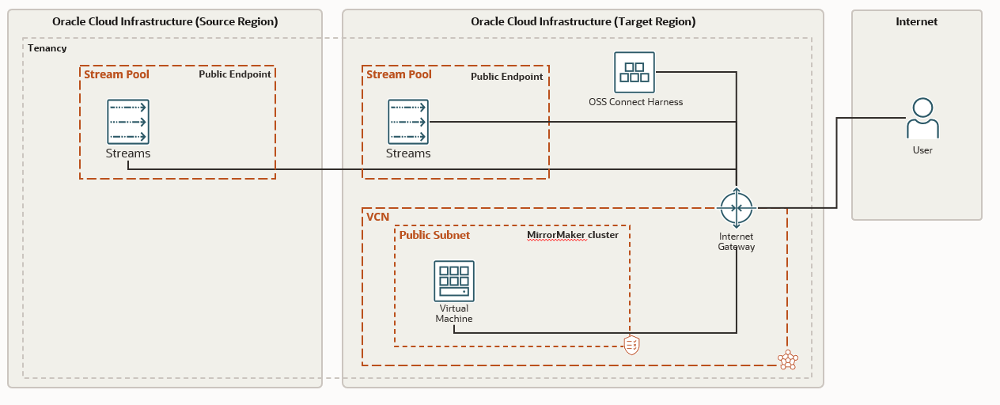

# oci-oss-mirrormaker

Mirror Maker 2 [MM2] is an open-source tool which allows users to geo replicate streams from one region to another. Following use-cases can be met with MM2

1.	Active-Passive setup
2.	Active-Active setup
3.	Migrating from on-premise to OSS
4.	Multi cloud setup

This quick start will get you started with the Mirror Maker 2 on OCI.


## Prerequisites

- Permission to `manage` the following types of resources in your Oracle Cloud Infrastructure tenancy: `vcns`, `internet-gateways`, `route-tables`, `network-security-groups`, `subnets`, `OSS`, and `instances`.

- Quota to create the following resources: 1 VCN, 1 subnets, 1 Internet Gateway, 1 NAT Gateway, 2 route rules, 2 OSS stream pools, 1 OSS Connect Harness and 1 compute instances.

If you don't have the required permissions and quota, contact your tenancy administrator. See [Policy Reference](https://docs.cloud.oracle.com/en-us/iaas/Content/Identity/Reference/policyreference.htm), [Service Limits](https://docs.cloud.oracle.com/en-us/iaas/Content/General/Concepts/servicelimits.htm), [Compartment Quotas](https://docs.cloud.oracle.com/iaas/Content/General/Concepts/resourcequotas.htm).

## Deploy Using the Terraform CLI

### Clone the Module
Now, you'll want a local copy of this repo. You can make that with the commands:

    git clone https://github.com/oracle-quickstart/oci-oss-mirrormaker.git
    cd oci-oss-mirrormaker
    ls

### Set Up and Configure Terraform

1. Complete the prerequisites described [here](https://github.com/cloud-partners/oci-prerequisites).

2. Create a `terraform.tfvars` file, and specify the following variables:

```
# Authentication
tenancy_ocid         = "<tenancy_ocid>"
current_user_ocid    = "<user_ocid>"
fingerprint          = "<finger_print>"
private_key_path     = "<pem_private_key_path>"

# Region
region = "<oci_region>"
targetRegion = "<target_region>"

# Compartment
compartment_ocid = "<compartment_ocid>"

generate_public_ssh_key = false
public_ssh_key = "<ssh-rsa AAAAB3NzaC .... rsa-key-20211034>"
private_ssh_key_path = "<path_to_pem_file>"


````

### Create the Resources
Run the following commands:

    terraform init
    terraform plan
    terraform apply

### Destroy the Deployment
When you no longer need the deployment, you can run this command to destroy the resources:

    terraform destroy

## Quick Start Architecture 

Mirror Maker 2 makes use of the Kafka connect ecosystem to instantiate three connectors, which are:-

1.	MirrorSourceConnector
2.	MirrorCheckpointConnector
3.	MirrorHeartbeatConnector

We will be creating the following resources for this Quick start
1. Stream pool in source and target regions
2. Kafka Connect Harness in the target region
3. VCN and instance in the public subnet of VCN.
4. And finally we install and run MM2 on the instance.

> **_NOTE:_**  This setup is only for OSS capability demonstration purpose. In production one would use private endpoints for streams and regions would be connected by the DRG or a VPN/Fastconnect.



### Limitations of the MM2 with OSS

-	OSS doesn’t support compacted topics yet. So creation of offsets, heartbeat and checkpointing topics by mirror maker will throw an exception. But when Auto Create Topics in enabled in the Stream Pool then at the time of publishing data these topics will be auto created although they will not be compacted.
-	sync.group.offsets.enabled=true is not supported in OSS
-	sync.topic.acls.enabled=true is not supported in OSS


